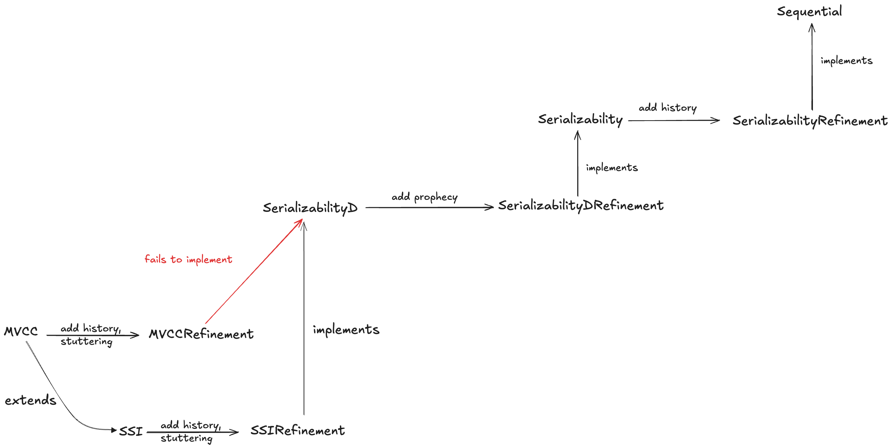

# Snapshot isolation in TLA+

## Blog posts

* [Specifying serializability in TLA+][1]
* [Multi-version concurrency control in TLA+][2]
* [Extending MVCC to be serializable, in TLA+][3]

[1]: https://surfingcomplexity.blog/2024/10/28/serializability-and-tla/
[2]: https://surfingcomplexity.blog/2024/10/31/multi-version-concurrency-control-in-tla
[3]: https://surfingcomplexity.blog/2024/11/03/extending-mvcc-to-be-serializable-in-tla/

## Refinement mappings

